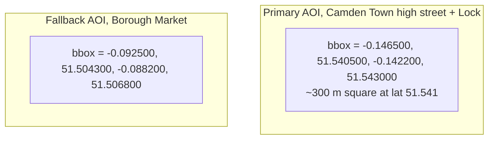
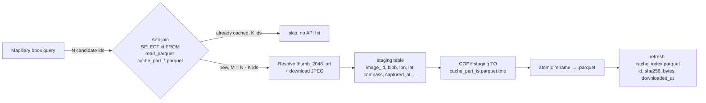
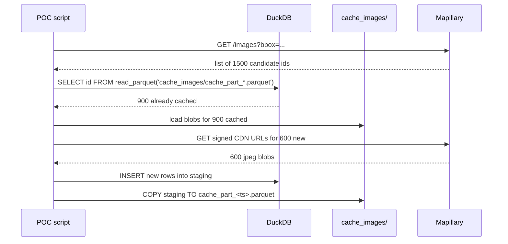
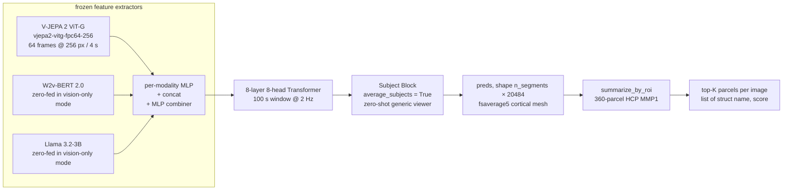
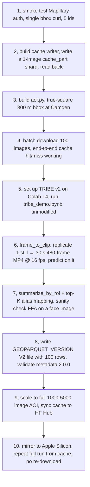

# POC, Mapillary → TRIBE v2 → GeoParquet 2.0

**Goal.** Pick a small, sensory-rich AOI in central London, pull street-level images with GPS, compass heading, and capture timestamp from Mapillary, **cache them first as native Parquet shards with the JPEG bytes inlined as `BLOB`** so the Mapillary API is hit at most once per image, and only **new** image ids (anti-joined against the cache) are ever downloaded. Then run each image through Meta FAIR's TRIBE v2 brain-encoding model and emit a single **GeoParquet 2.0** file, written natively by DuckDB 1.5.x (no GDAL), where each row is one image plus its predicted per-region brain activity.

**Cache-first contract.**
1. Every image is cached as `BLOB` in `cache_images/cache_part_*.parquet` along with `image_id`, `lon`, `lat`, `compass_angle`, **`captured_at` (UTC TIMESTAMP, parsed from Mapillary's epoch-ms field)**, `camera_type`, `sequence_id`, `image_sha256`, `image_bytes`, `downloaded_at`, and the originating `mapillary_bbox_query` for audit. Once a row is in the cache, its `image_blob` and metadata are permanent, Mapillary is never re-queried for that id.
2. Each pipeline run starts by listing candidate ids from the Mapillary bbox query, then **anti-joins** against `read_parquet('cache_images/cache_part_*.parquet')`. Only the set difference is downloaded.
3. The cache survives across machines (Mac ↔ Colab) via a private Hugging Face Hub dataset repo, so a fresh Colab session resumes from existing shards without hitting Mapillary at all.
4. The deliverable `london_aoi.parquet` is **derived** by joining the cache with the latest TRIBE v2 inference output. The cache is the source of truth for pixels, the deliverable is regenerated freely whenever the model or AOI changes.

**Authoring date.** 2026-04-30. Primary AOI is **Camden Town, London**, fallback **Borough Market**. Run targets are **Apple Silicon M3 Pro 36 GB** locally and **Colab Pro L4 24 GB** in the cloud.

---

## 0. Glossary, what "hormones or parts that increase in the viewer's mind" means here

TRIBE v2 does not predict hormones, it predicts **fMRI BOLD activity per cortical vertex** on the fsaverage5 mesh (20,484 vertices, 10,242 per hemisphere). Vertices group into the **HCP MMP1** parcellation (Glasser 2016, 360 parcels, 180 per hemisphere). Functional aliases the model recovers include,

- **FFA**, fusiform face area, faces.
- **PPA**, parahippocampal place area, scenes and places.
- **EBA**, extrastriate body area, bodies.
- **VWFA**, visual word-form area, written characters and signage.
- **STS, A5, area 45**, language and speech.
- **TPJ, MTG**, social and emotional inference.
- **V1, V4, MT/V5**, low-level vision and motion.

The released checkpoint `facebook/tribev2/best.ckpt` is **cortical only**. Subcortical ROIs (Hippocampus, Amygdala, Thalamus, Caudate, Putamen, Pallidum, Accumbens, Lateral Ventricle) are described in the paper but the subcortical weights are not in the public release. So when we talk about "amygdala activation for crowded streets" it is an aspirational extension, not the day-1 deliverable. The day-1 deliverable surfaces cortical regions (FFA / PPA / EBA / VWFA / STS / V1) per image.

---

## 1. End-to-end architecture

```mermaid
flowchart LR
    A[Define AOI bbox] --> B[Mapillary Graph API<br/>GET /images?bbox=...,fields=id,captured_at,...]
    B --> C{anti-join against<br/>cache_part_*.parquet by image_id}
    C -->|new ids only<br/>API hit minimized| D[Resolve thumb_2048_url<br/>+ download JPEG bytes]
    C -->|already cached| E[Skip download,<br/>load BLOB from existing shard]
    D --> F[Append rows to<br/>cache_part_<ts>.parquet<br/>BLOB + lon/lat/compass/captured_at]
    F --> G[Frame replicator<br/>1 still → 30 s 480-frame MP4 @ 16 fps]
    E --> G
    G --> H[TRIBE v2<br/>video-only mode<br/>vjepa2-vitg-fpc64-256]
    H --> I[preds, n_segments × 20484<br/>cortical activity]
    I --> J[summarize_by_roi<br/>360-parcel HCP MMP1]
    J --> K[top_regions, list of struct]
    K --> L[DuckDB INSERT into mapillary_london<br/>cache JOIN inference]
    L --> M[COPY ... GEOPARQUET_VERSION V2]
    M --> N[london_aoi.parquet<br/>GeoParquet 2.0]
```



Three storage artifacts live side by side,

| Artifact | Purpose | Schema | Size at 5k images |
|---|---|---|---|
| `cache_images/cache_part_*.parquet` | append-only **inline-BLOB** cache, one shard per session, the only place pixels live | id, **blob**, sha256, mime, bytes, w, h, lon, lat, compass, **captured_at**, camera_type, is_pano, sequence_id, creator_id, downloaded_at | ~2 GB |
| `cache_inference/cache_part_*.parquet` | append-only inference-result cache, makes mid-batch crashes recoverable, lets re-runs skip the encode+predict path on a cache hit | image_id, brain_activity (FLOAT[]), top_regions (STRUCT[]), inferred_at, model_repo | ~50 MB zstd |
| `cache_index.parquet` | skinny dedup index, scanned every run | image_id, downloaded_at, sha256, byte_size, source_parquet | ~10 MB |
| `london_aoi.parquet` | the GeoParquet 2.0 deliverable, regenerated per run, `geom` is `GEOMETRY('OGC:CRS84')` | id, blob, mime, captured_at, compass, camera, geom, brain_activity, top_regions | ~1.5 GB zstd |

---

## 2. AOI definition, Camden Town



Why Camden, dense weekend pedestrian flow, street art, costume shops, food market, canal scene, all of which exercise FFA / PPA / EBA / VWFA at once. London is among the best-mapped Mapillary cities and Camden has heavy contributor activity along the High Street and canal towpath.

**True-square bbox formula** at London latitude (`lat0 ≈ 51.541°N`),

```
dlat = side_m / 111320
dlon = side_m / (111320 * cos(lat0 * pi / 180))
bbox = (lon0 - dlon/2, lat0 - dlat/2, lon0 + dlon/2, lat0 + dlat/2)
```

For a 300 m side, `dlat ≈ 0.002695`, `dlon ≈ 0.004332`. The skinny lon-degree at this latitude means a degree-square is a 1.6 to 1 ground rectangle, the formula above corrects for that.

**Coverage dry-run** before committing to an AOI, costs ~1 unit of search quota,

```bash
curl -sG "https://graph.mapillary.com/images" \
  -H "Authorization: OAuth $MLY_TOKEN" \
  --data-urlencode "bbox=-0.146500,51.540500,-0.142200,51.543000" \
  --data-urlencode "fields=id,captured_at,camera_type" \
  --data-urlencode "limit=5"
```

5 IDs back with recent `captured_at` and `camera_type=perspective`, AOI is viable.

---

## 3. Mapillary Graph API, the only endpoints we use

> **Field-name correction.** The Image entity API documents `creator{id, username}` as a nested object, not the flat `creator_id` originally used in this plan. `creator_id` only appears under the *coverage tiles* section and may return `null` when requested from `/images`. The client now requests `creator` and parses `.creator.id`, with a fallback to `creator_id` for any older sequence-search responses.


**Auth**, the long-lived `Access Token` from the developer portal is sufficient for read-only image and metadata access. Header form is `Authorization: OAuth <TOKEN>` (literal word `OAuth`, not `Bearer`).

**Bounding-box search**,

```bash
curl -G "https://graph.mapillary.com/images" \
  -H "Authorization: OAuth $MLY_TOKEN" \
  --data-urlencode "bbox=-0.146500,51.540500,-0.142200,51.543000" \
  --data-urlencode "fields=id,captured_at,computed_geometry,computed_compass_angle,camera_type,is_pano,sequence,creator,thumb_2048_url" \
  --data-urlencode "start_captured_at=2023-04-30T00:00:00Z" \
  --data-urlencode "limit=2000"
```

Hard limits to respect,

- Max bbox area `0.01` square degrees (~1.1 km × 1.1 km near the equator). Larger fails, tile the AOI yourself.
- `limit` max **2000** per call. For more, sub-tile the bbox.
- Search rate, **10,000 calls / minute**. Entity rate, **60,000 / minute**.
- Filter `is_pano=false` to drop equirectangular frames, the model expects pinhole perspective.
- Prefer `computed_geometry` and `computed_compass_angle` over `geometry` / `compass_angle` (SfM-corrected).

**Image bytes**, `thumb_2048_url` returns a pre-signed Meta CDN URL, fetch it without an `Authorization` header (sending one can 403). Treat URLs as ephemeral, do not cache them, re-resolve from `/images` when re-downloading.

**KartaView**, fallback only. Mapillary in 2026 has materially denser and more recent London coverage, KartaView fills sequence gaps if needed.

---

## 4. Cache layer, **API-hit minimisation, native Parquet with inline BLOBs**

The cache is the **only** place pixels live. Mapillary is hit exactly once per image id, ever. The cache has three jobs,

1. Persist the JPEG bytes (`image_blob BLOB`), so we never re-download.
2. Persist the per-image Mapillary metadata that does not change, **`captured_at`**, `lon`, `lat`, `compass_angle`, `camera_type`, `sequence_id`, so we never re-query the API for them.
3. Be fast to anti-join against on every new bbox query, so a re-run with an expanded AOI only fetches the *delta*.

Two-file split,

- `cache_images/cache_part_<iso8601>.parquet`, append-only, one shard per session. Holds **JPEG bytes as `BLOB`** plus Mapillary metadata. Reader uses `read_parquet('cache_images/cache_part_*.parquet', union_by_name=true)`.
- `cache_index.parquet`, skinny dedup index (no blobs). Recomputed at the end of each session by scanning all shards.





**Anti-join with empty-cache safety**, ship a one-row sentinel `cache_part_000000_init.parquet` so the glob always matches.

```sql
INSTALL spatial; LOAD spatial;

CREATE OR REPLACE TABLE candidate_ids(image_id VARCHAR);
-- INSERT into candidate_ids from the Mapillary bbox response

WITH cached AS (
  SELECT image_id
  FROM read_parquet('cache_images/cache_part_*.parquet', union_by_name=true)
)
SELECT c.image_id
FROM candidate_ids c
LEFT JOIN cached k USING (image_id)
WHERE k.image_id IS NULL;
```

**Cache schema** (note `captured_at` is a real `TIMESTAMP`, parsed from Mapillary's epoch-ms `captured_at` field via `to_timestamp(captured_at_ms / 1000)`),

```sql
CREATE TABLE cache_images (
    image_id              VARCHAR PRIMARY KEY,    -- Mapillary image id
    image_blob            BLOB,                   -- raw JPEG bytes from thumb_2048_url
    image_sha256          VARCHAR,                -- sha256 of image_blob, for dedup integrity
    image_mime            VARCHAR DEFAULT 'image/jpeg',
    image_bytes           BIGINT,                 -- length(image_blob)
    image_width           INTEGER,                -- from Mapillary 'width' field
    image_height          INTEGER,                -- from Mapillary 'height' field
    downloaded_at         TIMESTAMP,              -- when WE fetched it (UTC)
    source                VARCHAR DEFAULT 'mapillary',
    mapillary_bbox_query  VARCHAR,                -- audit trail, e.g. "-0.1465,51.5405,-0.1422,51.5430"
    lon                   DOUBLE,                 -- from computed_geometry, EPSG:4326
    lat                   DOUBLE,
    compass_angle         DOUBLE,                 -- from computed_compass_angle, deg from north
    captured_at           TIMESTAMP,              -- WHEN the photo was taken, UTC, parsed from Mapillary epoch ms
    camera_type           VARCHAR,                -- 'perspective' | 'fisheye' | 'equirectangular'
    is_pano               BOOLEAN,
    sequence_id           VARCHAR,                -- Mapillary sequence id
    creator_id            BIGINT
);
```

`captured_at` matters for three reasons, (a) we filter to recent (>= 2023) and daytime frames before inference, (b) it lets us reconstruct pseudo-clips by ordering nearby images chronologically, (c) it ends up in the final GeoParquet so downstream consumers can slice the dataset by date.

**Download → stage → append-write a session shard**, atomic via `.tmp` + rename,

```sql
-- 1. Stage the freshly-downloaded rows in memory, BLOB column inlined.
CREATE OR REPLACE TEMP TABLE cache_images_staging AS
SELECT
  m.image_id,
  m.image_blob,
  sha256(m.image_blob)                  AS image_sha256,
  'image/jpeg'                          AS image_mime,
  length(m.image_blob)                  AS image_bytes,
  m.width                               AS image_width,
  m.height                              AS image_height,
  now()::TIMESTAMP                      AS downloaded_at,
  'mapillary'                           AS source,
  $bbox_query                           AS mapillary_bbox_query,
  m.lon, m.lat, m.compass_angle,
  to_timestamp(m.captured_at_ms / 1000) AS captured_at,
  m.camera_type, m.is_pano, m.sequence_id, m.creator_id
FROM mapillary_download_buffer m;       -- populated by the Python downloader

-- 2. Write atomically.
COPY (SELECT * FROM cache_images_staging)
TO 'cache_images/cache_part_2026-04-30T13-22-05Z.parquet.tmp'
(FORMAT PARQUET, COMPRESSION ZSTD, COMPRESSION_LEVEL 9, ROW_GROUP_SIZE 1024);
-- then os.rename(...tmp, ...parquet) so partial writes are never visible.
```

**Portability between Mac and Colab**, sync the `cache_images/` directory through a **private Hugging Face Hub dataset repo**. `huggingface_hub.snapshot_download(repo_type='dataset', local_dir='cache_images/')` at session start, `upload_folder(...)` at session end. Versioned via git LFS, free private repos, identical UX on both platforms, no Google Drive flakiness.

**No eviction.** Mapillary photos are immutable once captured. At ~50 GB (around 125 k images) switch from inline `image_blob` to `image_uri VARCHAR` pointing at R2 / S3, the anti-join logic stays identical.

---

## 5. TRIBE v2 inference layer



**Model facts that matter,**

- Repo, `facebookresearch/tribev2`, license **CC-BY-NC-4.0**, fine for research POC, not fine for any monetised product.
- Weights, `facebook/tribev2/best.ckpt`, 676 MB, fp32, no bf16 / fp16 / quantized variant on HF.
- Vision-only mode is supported via `modality_dropout=0.3` training, set `features_to_mask=["text","audio"]` or just provide no audio / text. Llama gating is then irrelevant.
- Subject Block, `from_pretrained` forces `average_subjects = True`, predictions are zero-shot for a generic viewer.
- Output, `preds` is `(n_segments, 20484)` cortical activity at 1 Hz, shifted -5 s for hemodynamic lag. `n_segments` is the number of TRs (1 s each) extracted from the clip.
- **`remove_empty_segments = False`**, the runner overrides the upstream default after `from_pretrained`. The default drops segments whose `ns_events` list is empty, which on a silent static clip wipes out the whole prediction. Forcing `False` keeps every TR so visual-cortex activations survive.

**Single-image trick.** V-JEPA 2 expects a video clip per 2 Hz time bin. There is no single-image entry point. We replicate one Mapillary still **480 times into a 30-second MP4 at 16 fps** (`src/frame_to_clip.py::jpeg_to_static_clip`) and feed `video_path=...`. The 30 s length matches TRIBE's `ChunkEvents min_duration=30 s, max_duration=60 s` window, shorter clips are dropped or merged by the upstream chunker and produce zero predictions. Caveat, V-JEPA 2 was trained on real motion, motion-area (MT/V5) responses on a static clip will be attenuated, ventral-stream responses (FFA / PPA / EBA / VWFA / V1) are well-supported by paper Fig 4 in-silico IBC localizers, which themselves used 1 s flashed images.

**Minimal inference snippet (verbatim from repo README)**,

```python
from tribev2 import TribeModel

model = TribeModel.from_pretrained("facebook/tribev2", cache_folder="./cache")
df = model.get_events_dataframe(video_path="static_clip.mp4")
preds, segments = model.predict(events=df)   # preds: (n_segs, 20484), float32

# Map to HCP MMP1 360 parcels
from tribev2.utils import get_hcp_labels, summarize_by_roi
roi_vec = summarize_by_roi(preds[0])         # 360-d, parcel-mean activity
labels  = get_hcp_labels(mesh="fsaverage5")  # {parcel_name: [vertex_indices]}
```

Top-K functional ROIs we surface per image (alias-mapped from HCP MMP1 parcels via `get_hcp_roi_indices`),

| Alias | HCP MMP1 parcels (illustrative) | What it means |
|---|---|---|
| FFA | FFC | faces present and salient |
| PPA | PHA1, PHA2, PHA3 | place / scene encoding |
| EBA | TE2p, PH | bodies / pedestrians |
| VWFA | VVC, TE2p | written signage |
| STSdp / STSva | STSdp, STSva | social inference |
| 45 / A5 | 45, A5 | language regions |
| MT/V5 | MT, MST | motion (attenuated on static clips) |
| V1 | V1 | low-level retinotopy |

---

## 6. GeoParquet 2.0 deliverable, native DuckDB write

DuckDB core's Parquet writer accepts `GEOPARQUET_VERSION` directly. Verified values from `duckdb/duckdb` `test/geoparquet/versions.test`,


| Value | `geo` metadata | Native Parquet `GEOMETRY` logical type |
|---|---|---|
| omitted (default) | `1.0.0` (WKB) | no |
| `'V1'` | `1.0.0` (WKB) | no |
| `'NONE'` | none | yes |
| `'BOTH'` | `1.0.0` | yes |
| `'V2'` | `2.0.0` | yes |

We pick `'V2'`, that is the actual GeoParquet 2.0 the user asked for, native Parquet `GEOMETRY` plus the 2.0.0 metadata block.

**Table DDL,**

```sql
INSTALL spatial; LOAD spatial;

CREATE OR REPLACE TABLE mapillary_london (
  image_id        VARCHAR PRIMARY KEY,
  image_blob      BLOB,
  image_mime      VARCHAR,
  captured_at     TIMESTAMP,
  compass_angle   DOUBLE,
  camera_type     VARCHAR,
  geom            GEOMETRY('OGC:CRS84'),                 -- POINT(lon lat), CRS attached via ST_SetCRS
  brain_activity  FLOAT[],                               -- 360-d ROI mean vector
  top_regions     STRUCT(name VARCHAR, score FLOAT)[]    -- top-K per image
);
```

**CRS, the v1.5 typed-column way.** DuckDB 1.5 made `GEOMETRY` a core type that carries an optional CRS as part of its column type. We attach **`OGC:CRS84`** explicitly via `ST_SetCRS` so the deliverable advertises its CRS in three places at once,

1. The Parquet logical type, `GeometryType(crs={...PROJJSON for OGC:CRS84...})`.
2. The `geo` KV metadata under `columns.geom.crs` (PROJJSON form).
3. The DuckDB column type on read-back, `GEOMETRY('OGC:CRS84')`.

Without `ST_SetCRS` the column is still a valid GeoParquet V2 (the spec defaults missing `crs` to OGC:CRS84), but the CRS stays implicit. Making it explicit avoids surprises in downstream tools that don't apply the spec default. We also pin `SET geometry_always_xy = true` on the writer session so lon/lat axis order survives the DuckDB 2.1 default flip.

**Insert + native write, joined cache + inference, no GDAL,** (verbatim from `src/geoparquet_writer.py::write_geoparquet_v2`),

```sql
INSTALL spatial; LOAD spatial;
SET geometry_always_xy = true;

COPY (
  SELECT
    c.image_id,
    c.image_blob,
    c.image_mime,
    c.captured_at,
    c.compass_angle,
    c.camera_type,
    ST_SetCRS(ST_Point(c.lon, c.lat), 'OGC:CRS84') AS geom,
    inf.brain_activity,
    inf.top_regions
  FROM read_parquet('cache_images/cache_part_*.parquet', union_by_name=true) c
  JOIN inference_results inf USING (image_id)
  WHERE c.image_id <> '__sentinel__'
    AND c.lon BETWEEN -0.1465 AND -0.1422
    AND c.lat BETWEEN  51.5405 AND  51.5430
) TO 'london_aoi.parquet' (
  FORMAT PARQUET,
  GEOPARQUET_VERSION 'V2',
  COMPRESSION 'ZSTD',
  COMPRESSION_LEVEL 9,
  ROW_GROUP_SIZE 2048
);
```

**Read-back verification,**

```sql
LOAD spatial;
SET geometry_always_xy = true;

-- column type round-trips with its CRS attached
DESCRIBE FROM read_parquet('london_aoi.parquet');
-- expect: geom    GEOMETRY('OGC:CRS84')

SELECT image_id, ST_AsText(geom) AS wkt, ST_CRS(geom) AS crs, length(image_blob) AS bytes
FROM read_parquet('london_aoi.parquet') LIMIT 5;
-- expect: wkt = POINT (lon lat), crs = OGC:CRS84

-- confirm GeoParquet 2.0 metadata was emitted
SELECT decode(value)
FROM parquet_kv_metadata('london_aoi.parquet')
WHERE decode(key) = 'geo';
-- expect: {"version":"2.0.0","primary_column":"geom",...,"crs":{...PROJJSON...}}

-- confirm native Parquet GEOMETRY logical type carries the CRS
SELECT name, logical_type FROM parquet_schema('london_aoi.parquet') WHERE name = 'geom';
-- expect: geom    GeometryType(crs={...PROJJSON for OGC:CRS84...})
```

```python
import pyarrow.parquet as pq, json
meta = pq.read_metadata("london_aoi.parquet").metadata
print(json.loads(meta[b"geo"])["version"])   # 2.0.0
```

---

## 7. Hardware sizing

| Target | Config | Throughput | Verdict |
|---|---|---|---|
| M3 Pro 36 GB, MPS | bf16, ViT-G, batch 1, `PYTORCH_ENABLE_MPS_FALLBACK=1` | ~0.5-1 img/s | usable, MPS fallbacks may bounce some ops to CPU |
| M3 Max 64-128 GB, MPS | bf16, batch 1-2 | ~1.5-3 img/s | ideal local target |
| Colab Pro T4 16 GB | fp32 sequential extractors, batch 1 | ~0.5-1 img/s | tight, T4 has no FlashAttention |
| Colab Pro **L4 24 GB** | fp32 or fp16, batch 2-4, FA-2 | **~2-4 img/s** | **recommended cloud target** |
| Colab Pro+ A100 40 GB | fp32, batch 8 | ~8-15 img/s | overkill for 5k images |

**Wall-clock for a 1000-image POC,** Mapillary download dominates on fast tiers,

- M3 Pro MPS, ~7 min download + ~15-20 min inference + ~20 s parquet write ≈ **23-28 min**.
- Colab L4, ~7 min download + ~6-8 min inference + ~20 s write ≈ **14-16 min**.
- Colab A100, ~7 min + ~2 min + ~20 s ≈ **10 min**.

**Estimates, not measured numbers**, TRIBE v2 inference VRAM is dominated by the frozen extractors (V-JEPA 2 ViT-G ~4 GB fp32, Llama 3.2-3B ~12 GB fp32, W2v-BERT 2.3 GB fp32), the released checkpoint itself is only 676 MB. In vision-only mode, Llama can be skipped entirely, dropping ~12 GB.

---

## 8. Project layout (target)

```
hnc/
├── PLAN.md                              # this file (the spec)
├── README.md                            # quickstart, points back to PLAN
├── pyproject.toml                       # PEP 621, managed by uv (Astral)
├── uv.lock                              # committed for reproducibility
├── .env                                 # MAPILLARY_ACCESS_TOKEN, HF_TOKEN, ...
├── .env.example                         # checked-in template, no secrets
├── .gitignore
├── docs/                                # TRIBE v2 paper PDF, blog, refs
├── .claude/
│   └── skills/duckdb/                   # installed reference skill (16 files)
└── src/
    ├── env.py                           # dotenv loader, get_mapillary_token()
    ├── aoi.py                           # bbox helpers, true-square formula
    ├── mapillary_client.py              # bbox → list[ImageMeta], CDN downloader
    ├── cache.py                         # DuckDB read_parquet anti-join, shard writer
    ├── inference_cache.py               # resumable per-image_id inference shard cache
    ├── frame_to_clip.py                 # JPEG → 30 s 480-frame MP4 @ 16 fps
    ├── tribe_runner.py                  # TribeModel.from_pretrained + predict
    ├── roi_summary.py                   # summarize_by_roi + top-K HCP aliases
    ├── geoparquet_writer.py             # final GEOPARQUET_VERSION 'V2' COPY w/ ST_SetCRS('OGC:CRS84')
    └── pipeline.py                      # orchestration, idempotent, resumable

cache_images/                            # gitignored, synced to HF dataset repo
├── cache_part_000000_init.parquet       # one-row sentinel, glob always matches
├── cache_part_2026-04-30T13-22-05Z.parquet
└── ...
cache_inference/                         # gitignored, per-image_id inference checkpoint
├── cache_part_000000_init.parquet       # one-row sentinel
└── cache_part_<ts>.parquet              # brain_activity + top_regions, model_repo audit
london_aoi.parquet                       # the GeoParquet 2.0 deliverable, GEOMETRY('OGC:CRS84')
```

**Tooling.** Python `>=3.11`, package manager **`uv`** (Astral). All dependencies live in `pyproject.toml` under `[project.dependencies]` (core) and `[project.optional-dependencies.tribe]` (heavy ML deps). Standard flow,

```bash
cp .env.example .env                     # then fill MAPILLARY_ACCESS_TOKEN
uv sync --all-extras                     # creates .venv, resolves + installs core + tribe + dev
uv run hnc-run --bbox-name camden --max-images 100
```

**Pin notes that matter,**

- `numpy>=2.2,<2.5`, tribev2 hard-pins `numpy==2.2.6`, anything tighter on the floor breaks resolution.
- `duckdb>=1.5.2,<2`, the v2.0 spatial axis-order default flips and would silently swap lon/lat in `ST_Point`.
- `tribev2` pinned to commit `72399081ed3f1040c4d996cefb2864a4c46f5b8e`, upstream has no tags and may force-push `main`.
- `torch>=2.5.1,<2.7`, `torchvision>=0.20,<0.22`, matches tribev2's hard caps.
- `huggingface_hub>=1.13.0`, mirrored in the `tribe` extra so a future upstream cap can't surprise the resolver.
- On Blackwell GPUs (sm_120) the default torch wheels miss kernels, see the cu128 reinstall in `notebooks/colab.ipynb` cell 6.

**`.env` keys (normalized, UPPER_SNAKE_CASE).** The legacy "App ID" / "Access Token" with spaces was rewritten to,

```
MAPILLARY_APP_ID=...
MAPILLARY_ACCESS_TOKEN=...
MAPILLARY_CLIENT_SECRET=...
MAPILLARY_AUTH_URL=...
HF_TOKEN=...                             # optional, for cache sync to HF Hub
HF_DATASET_REPO_ID=...                   # optional
```

`src/env.py` reads them via `python-dotenv`. No legacy fallback parser, the `.env` is the single source of truth.

---

## 9. Build sequence



---

## 10. Risks and known unknowns

- **Subcortical ROIs absent from public weights.** Amygdala / accumbens / hippocampus hooks marketed in the paper are not in the released cortical-only checkpoint. Surface only cortical aliases on day 1, flag subcortical as a v2 extension that needs separate weights.
- **Static-clip OOD for V-JEPA 2.** Frame replication understates motion-area (MT/V5) responses. Acceptable for a perception-of-place POC, surface this caveat in the deliverable's metadata.
- **Llama 3.2 gating.** If we ever want the text branch, the user must accept the Meta Llama Community License on HF. Vision-only mode sidesteps this entirely.
- **CC-BY-NC-4.0.** The deliverable parquet inherits the model's non-commercial constraint, monetisation is not allowed. Attribute d'Ascoli et al., 2026.
- **Mapillary CDN URL freshness.** Signed URLs expire, do not store URLs in the cache, only the resolved image bytes.
- **MPS quirks on Apple Silicon.** Set `PYTORCH_ENABLE_MPS_FALLBACK=1`, expect occasional silent CPU bounces. If MPS misbehaves on the fusion transformer, fall back to bf16 CPU on M3 Pro at ~0.1-0.2 img/s, painful for 5000 but fine for a 200-image smoke test.
- **GeoParquet 2.0 reader compatibility.** As of 2026-04, native Parquet `GEOMETRY` logical type plus 2.0.0 metadata is read by DuckDB 1.5+, libarrow trunk, and recent GeoPandas, older readers (GeoPandas <1.1, GDAL <3.13) may need the `'BOTH'` mode (1.0 metadata + native type) for compatibility. The plan defaults to `'V2'`, switch to `'BOTH'` if downstream consumers complain.

---

## 11. References

- Mapillary Graph API, https://www.mapillary.com/developer/api-documentation
- TRIBE v2 blog, https://ai.meta.com/blog/tribe-v2-brain-predictive-foundation-model/
- TRIBE v2 paper (local), `docs/657045057_4517522795185706_3804826277082824742_n.pdf`, d'Ascoli et al., 2026
- TRIBE v2 code, https://github.com/facebookresearch/tribev2
- TRIBE v2 weights, https://huggingface.co/facebook/tribev2
- DuckDB Parquet writer source (verified for `GEOPARQUET_VERSION 'V2'`), `duckdb/duckdb/test/geoparquet/versions.test`
- DuckDB spatial extension, https://duckdb.org/docs/extensions/spatial
- Installed reference skill, `.claude/skills/duckdb/` (16 files, see `references/spatial.md`, `references/geography.md`)
- HCP MMP1 parcellation, Glasser et al., 2016, fetched at runtime by TRIBE v2 via `mne.datasets.fetch_hcp_mmp_parcellation`
