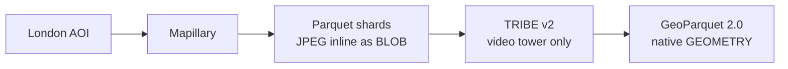

# hnc

Mapillary AOI to TRIBE v2 brain-encoding to GeoParquet 2.0.

Part of the [Hormones & Cities](https://walkthru.earth/hormones-cities) initiative under [walkthru-earth](https://github.com/walkthru-earth).

## What it does

Picks a small sensory-rich AOI in central London, pulls street-level imagery from Mapillary with GPS, compass heading, and capture timestamp, caches the JPEG bytes inline as Parquet shards (anti-join keeps API hits to new images only), runs each frame through Meta FAIR's [TRIBE v2](https://github.com/facebookresearch/tribev2) vision-only brain-encoding model, and writes one native GeoParquet 2.0 file via DuckDB 1.5.x with predicted cortical activity per HCP MMP1 parcel.



## Output schema

One row per image with `image_blob`, `image_id`, `lon`, `lat`, `compass_angle`, `captured_at`, `geom` (native Parquet GEOMETRY logical type), and a fixed-length array of 20484 cortical vertex activations on the fsaverage5 mesh, summarized to 360 HCP MMP1 parcels plus a small set of functional ROI aliases (FFA, PPA, EBA, V1, MT, and similar).

## Setup

```bash
uv sync
cp .env.example .env   # fill MAPILLARY_ACCESS_TOKEN
```

For brain-encoding inference, also install the `tribe` extra (heavy ML deps, requires Llama 3.2 license acceptance).

```bash
uv sync --extra tribe
```

## Usage

```bash
# Smoke run, Camden Town bbox, 50 images
uv run hnc-run --bbox-name camden --max-images 50

# Borough Market bbox
uv run hnc-run --bbox-name borough --max-images 50
```

## Output

```
out/
  cache_images/
    images_*.parquet     # JPEG bytes + capture metadata, anti-joined on image_id
  hnc_london.parquet     # GeoParquet 2.0, native GEOMETRY, ZSTD-9
```

## Stack

uv, DuckDB 1.5.x with `GEOPARQUET_VERSION 'V2'`, httpx for the Mapillary Graph API, PyArrow, TRIBE v2 (V-JEPA2 ViT-G plus W2v-BERT plus Llama 3.2-3B). Apple Silicon friendly, Colab Pro L4 24GB friendly.

## Reference

See `PLAN.md` for full architecture, schema, and milestones.

## License

Source code in this repository is licensed under [CC BY 4.0](https://creativecommons.org/licenses/by/4.0/) by [walkthru.earth](https://github.com/walkthru-earth). See [LICENSE](LICENSE).

Runtime data and model artifacts have separate terms (TRIBE v2 CC-BY-NC-4.0, Llama 3.2 Community License, Mapillary Terms, HCP MMP1, FreeSurfer). See [NOTICE.md](NOTICE.md) for the full list.

Contact, [hi@walkthru.earth](mailto:hi@walkthru.earth)
